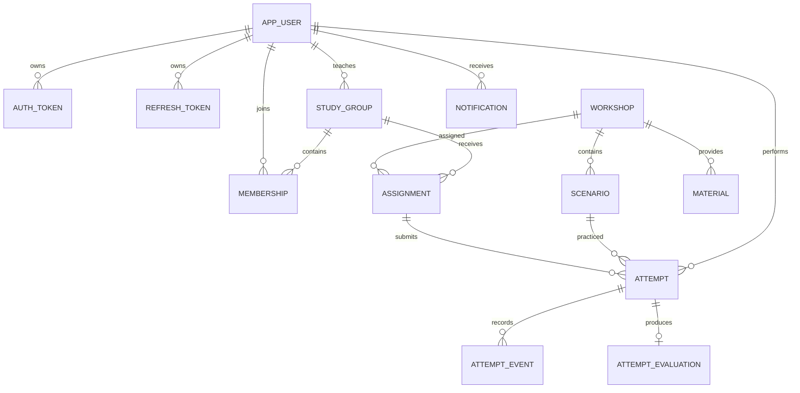

# DeployLab Backend

**Curso:** Desarrollo Basado en Plataformas (DBP), ciclo 2026-2  
**Proyecto:** API para aprendizaje mediante simulación de incidentes  
**Equipo:** Tom — completar apellidos y demás integrantes antes de la entrega

DeployLab es una plataforma educativa donde un estudiante practica el diagnóstico de fallas de backend en escenarios controlados. Cada escenario presenta evidencia, acciones posibles y una explicación. El estudiante inicia un intento, registra decisiones y lo finaliza para obtener una evaluación persistida. Un instructor crea talleres, administra grupos, asigna actividades y revisa resultados.

Este repositorio contiene el backend completo: API REST, seguridad, modelo de datos, migraciones, motor transaccional, documentación OpenAPI, pruebas, colección de Postman y configuración local. No incluye una interfaz web.

## Contenido

1. [Problema y objetivos](#problema-y-objetivos)
2. [Solución y funciones](#solución-y-funciones)
3. [Arquitectura y tecnologías](#arquitectura-y-tecnologías)
4. [Modelo de datos](#modelo-de-datos)
5. [Seguridad](#seguridad)
6. [Eventos y procesos asíncronos](#eventos-y-procesos-asíncronos)
7. [API](#api)
8. [Ejecución local](#ejecución-local)
9. [Pruebas y calidad](#pruebas-y-calidad)
10. [Gestión del proyecto](#gestión-del-proyecto)
11. [Límites y trabajo futuro](#límites-y-trabajo-futuro)

## Problema y objetivos

Los conceptos de autenticación, autorización, contratos HTTP, conexión a datos e idempotencia suelen estudiarse por separado. Cuando aparece una falla real, el estudiante debe relacionar evidencia con una causa y elegir una corrección sin poner en riesgo un sistema en producción. DeployLab ofrece ese espacio de práctica con datos ficticios y estados reproducibles.

El objetivo general es proporcionar una API segura para ejecutar y evaluar simulaciones de incidentes. Sus objetivos específicos son conservar el historial de decisiones, calcular una nota reproducible, separar prácticas personales de entregas, permitir seguimiento docente y demostrar patrones de backend como JWT, capas, persistencia relacional, eventos, concurrencia y manejo uniforme de errores.

## Solución y funciones

El núcleo solicitado cubre registro y login, consulta de talleres, inicio de intentos, registro de acciones y finalización. El backend amplía ese flujo con:

- JWT de corta duración, refresh token rotatorio y logout con revocación.
- Catálogo paginado y filtrable por tema, dificultad y habilidad.
- Intentos con eventos ordenados, pistas, idempotencia y bloqueo de fila.
- Evaluación final: `max(0, 100 - 10 × errores - 5 × pistas)` cuando el caso fue resuelto; cero si se entrega sin resolver.
- Talleres de instructor, grupos, membresías, plazos, asignaciones y revisión de entregas.
- Materiales PDF en PostgreSQL y una integración S3 opcional.
- Notificaciones internas, correo opcional y reportes CSV procesados como trabajos.
- Paneles de progreso personal y estadísticas de grupo.

Una práctica personal nunca se convierte implícitamente en entrega. Los intentos de una tarea guardan su `assignment_id`, por lo que los reportes del grupo no mezclan trabajo privado del estudiante.

## Arquitectura y tecnologías

El proyecto usa Java 21, Spring Boot 3.5.7, Spring MVC, Spring Security, Spring Data JPA, Bean Validation, Flyway, PostgreSQL 17, Spring Mail, AWS SDK S3, Springdoc, JUnit 5, MockMvc y JaCoCo. Maven Wrapper evita depender de una instalación global de Maven.

La API sigue Controller → Service → Repository/persistencia. Los controladores reciben DTO, validan el contrato y delegan. Los servicios contienen permisos, transacciones y reglas. Las entidades JPA expresan relaciones, restricciones e índices; los repositorios Spring Data ofrecen consultas tipadas. Las consultas especializadas pasan por un repositorio nativo basado en `EntityManager`, por lo que los servicios no dependen de `JdbcTemplate`. Flyway conserva el control exclusivo de la estructura del esquema.

```text
src/main/java/edu/deploylab/
├── *Controller.java       rutas y códigos HTTP
├── *Service.java          casos de uso y transacciones
├── dto/                   contratos de entrada y salida
├── persistence/           entidades y repositorios JPA
├── *Event.java            eventos de dominio
└── SecurityConfig.java    JWT, roles, CORS y sesión stateless
src/main/resources/db/migration/  evolución SQL V1–V7
src/test/java/edu/deploylab/      pruebas de contrato, integración y motor
```

## Modelo de datos

Flyway crea y evoluciona la base. JPA usa `ddl-auto=none`, de modo que las entidades validan el modelo sin modificarlo automáticamente. Las asociaciones se cargan de forma diferida y las operaciones de intento usan transacciones y bloqueo pesimista.



Las restricciones principales incluyen correo único, una membresía por usuario y grupo, una asignación de taller por grupo, una evaluación por intento, claves idempotentes únicas por intento y claves foráneas con borrado controlado.

## Seguridad

El registro público siempre crea un `STUDENT`; no acepta un rol enviado por el cliente. Las contraseñas se guardan con BCrypt. El login emite un JWT firmado con `sub`, `jti`, correo, rol, fecha de emisión y vencimiento de 15 minutos. Su hash también se registra para permitir revocación. El refresh token es aleatorio, dura siete días, se almacena como SHA-256 y rota en cada uso; reutilizar uno anterior devuelve 401. El logout revoca la sesión y todos los refresh tokens activos del usuario.

Spring Security trabaja sin sesión HTTP. `UserDetailsService` integra usuarios persistidos y `@PreAuthorize` protege operaciones de instructor o estudiante. Los servicios además comprueban propiedad y membresía; pedir un intento ajeno responde 404 para no revelar su existencia. CORS se configura mediante `CORS_ORIGIN`.

Los errores tienen un mismo DTO: `timestamp`, `status`, `error`, `message` y `path`. El `ControllerAdvice` trata validación, JSON inválido, recursos ausentes, conflictos, permisos, archivos grandes y excepciones del dominio. Existen excepciones específicas para credenciales, acceso, recurso ausente, duplicidad, operación inválida, plazo vencido, almacenamiento y petición inválida.

## Eventos y procesos asíncronos

Después de confirmar una transacción se publican `UserRegisteredEvent`, `AssignmentCreatedEvent` y `AttemptFinishedEvent`. Tres listeners con `@Async` los procesan en un `ThreadPoolTaskExecutor` de 2 a 8 hilos y cola de 100 tareas. Los logs incluyen tipo de evento, identificadores y fecha, sin contraseñas ni tokens.

La asignación genera inmediatamente una notificación interna y encola un trabajo de correo. `JobWorker` procesa correos y reportes CSV con reintentos; si SMTP está desactivado, la tarea falla de manera controlada sin revertir la asignación. El envío real usa Spring Mail cuando `MAIL_ENABLED=true`.

## API

El flujo principal usa estas rutas:

| Método | Ruta | Resultado |
|---|---|---|
| POST | `/auth/register` | Crea estudiante, 201 |
| POST | `/auth/login` o `/login` | JWT, refresh token y usuario |
| POST | `/auth/refresh` | Rota tokens |
| GET | `/talleres` | Catálogo publicado |
| GET | `/talleres/{id}` | Escenarios y evidencia |
| POST | `/escenarios/{id}/intentos` | Inicia intento, 201 |
| POST | `/intentos/{id}/acciones` | Registra evento con `Idempotency-Key` |
| POST | `/intentos/{id}/finalizar` | Persiste evaluación e historial |

Los módulos bajo `/api` exponen talleres, plantillas, intentos, progreso, grupos, miembros, asignaciones, entregas, materiales, trabajos, reportes, notificaciones y panel. Los listados principales aceptan `page` y `size`; catálogo también acepta `topic`, `difficulty` y `skill`. Swagger separa las especificaciones `core` y `modules` en `http://localhost:8080/swagger-ui/index.html`.

## Ejecución local

Requisitos: Java 21 y PostgreSQL 17. En Windows, desde la raíz:

```powershell
.\scripts\Start-Local.ps1
.\scripts\Demo.ps1
.\scripts\Demo-Modules.ps1
```

El script inicia una base aislada en `data/postgres`, normalmente en el puerto 55440, y guarda las credenciales locales en un archivo excluido de Git. Para detenerla: `.\scripts\Stop-Local.ps1`. Para ejecutar solo el núcleo: `.\scripts\Start-Local.ps1 -CoreOnly`.

Con Docker, copia `.env.example` a `.env`, cambia secretos y ejecuta `docker compose up --build`. Compose incluye PostgreSQL y Mailpit. Las variables principales son `DB_URL`, `DB_USER`, `DB_PASSWORD`, `JWT_SECRET`, `CORS_ORIGIN`, `INSTRUCTOR_EMAIL`, `INSTRUCTOR_PASSWORD`, `MAIL_ENABLED`, variables `SMTP_*`, `S3_BUCKET` y `AWS_REGION`. En un entorno real, `JWT_SECRET` debe contener al menos 32 bytes aleatorios.

## Pruebas y calidad

```powershell
.\mvnw.cmd verify
```

La suite cubre contratos HTTP, JWT y rotación, roles, idempotencia, concurrencia, rollback, evaluación, grupos, plazos, privacidad, archivos e integraciones simuladas. Puede ejecutarse con H2 en modo PostgreSQL o con PostgreSQL mediante `TEST_DB_URL`, `TEST_DB_USER` y `TEST_DB_PASSWORD`. JaCoCo genera `target/site/jacoco/index.html`; la medición anterior a esta alineación superaba 80 % de instrucciones. La CI levanta PostgreSQL 17, ejecuta `verify` y conserva reportes y cobertura como artefactos.

La colección raíz `postman_collection.json` usa variables para URL, JWT e identificadores. La documentación OpenAPI permite explorar y probar todas las rutas desde Swagger.

## Gestión del proyecto

El historial de Git conserva cambios pequeños y revisables, incluidos ciclos RED/GREEN donde una prueba reproduce una falla antes de aplicar la corrección. `git log --oneline --reverse` muestra la evolución. La rama `feat/rubric-alignment` separa JPA, JWT, errores, eventos y DTO/roles en commits distintos. GitHub Actions valida cada push y pull request.

Antes de entregar deben completarse los nombres del equipo y registrar en GitHub los issues, responsables y milestones usados durante el trabajo. El repositorio público es [tomlaura-bit/deploylab-backend](https://github.com/tomlaura-bit/deploylab-backend).

## Límites y trabajo futuro

El backend no incluye frontend, recuperación de contraseña, verificación de correo ni administración general de roles. Los escenarios usan plantillas seguras y no ejecutan código arbitrario. El PDF local valida tamaño, nombre y cabecera, pero no incorpora antivirus. S3 y SMTP tienen manejo de indisponibilidad y pruebas con dobles; requieren credenciales externas para una validación real.

El siguiente crecimiento razonable es reemplazar gradualmente las consultas nativas más complejas por proyecciones Spring Data, usar PostgreSQL administrado también en AWS, añadir observabilidad y construir el cliente web. La implementación actual prioriza un núcleo transaccional reproducible y deja esas extensiones aisladas.

## Licencia y referencias

Uso académico para el curso DBP 2026-2. El equipo conserva los derechos; no se autoriza redistribución comercial sin permiso.

Referencias: [Spring Boot](https://docs.spring.io/spring-boot/), [Spring Security](https://docs.spring.io/spring-security/reference/), [Spring Data JPA](https://docs.spring.io/spring-data/jpa/reference/), [Flyway](https://documentation.red-gate.com/fd), [JWT RFC 7519](https://www.rfc-editor.org/rfc/rfc7519), [PostgreSQL](https://www.postgresql.org/docs/) y [OpenAPI](https://spec.openapis.org/oas/latest.html).
